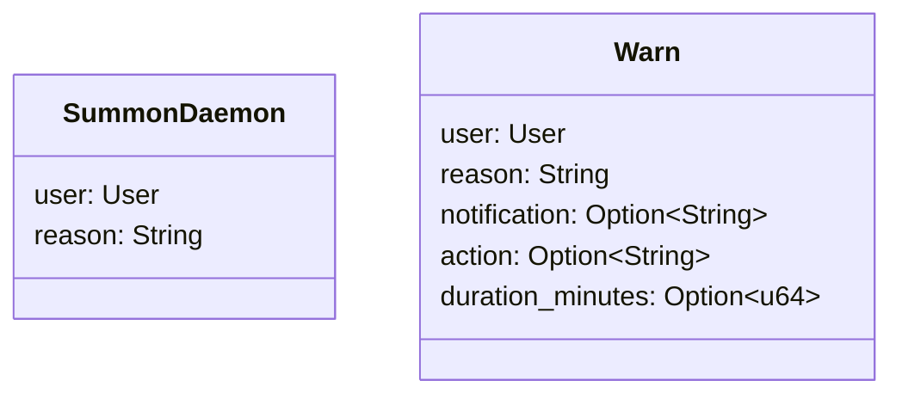

# Analysis of summon_daemon and warn Commands

This document provides a detailed analysis of the `summon_daemon` and `warn` commands, highlighting their similarities and differences, along with recommendations for improvement.

## Overview

Both commands are part of a Discord moderation bot that allows server moderators to warn users and apply enforcement actions. However, they serve different purposes and have distinct implementations.

## Key Similarities

1. **Command Structure**: Both are implemented as Discord slash commands with similar permission requirements
2. **Core Function**: Both issue warnings to users for inappropriate behavior
3. **Data Management**: Both store warning data in the same underlying data structures
4. **Permission Requirements**: Both require moderator-level permissions
5. **Enforcement Pipeline**: Both can lead to enforcement actions via the same enforcement system

## Key Differences

1. **Purpose and Scope**:
   - `summon_daemon`: Specifically for voice channel behavior moderation
   - `warn`: General-purpose moderation for any type of behavior

2. **Parameters**:
   - `summon_daemon`: Only accepts user and reason
   - `warn`: Accepts additional parameters (notification method, action type, duration)

3. **Warning Accumulation**:
   - `summon_daemon`: Uses a weighted warning system with accumulating scores
   - `warn`: Each warning operates independently

4. **Enforcement Mechanism**:
   - `summon_daemon`: Threshold-based enforcement after multiple warnings
   - `warn`: Immediate enforcement with configurable actions

5. **Randomness**:
   - `summon_daemon`: Incorporates a "chaos factor" for random enforcement
   - `warn`: Deterministic enforcement based on specified parameters

## Detailed Comparison

### Command Parameters

### Enforcement Flow

```mermaid
flowchart TB
    subgraph summon_daemon
        SD1[Receive Command] --> SD2[Get Guild Config]
        SD2 --> SD3[Add to User Warning State]
        SD3 --> SD4[Calculate Warning Score]
        SD4 --> SD5[Add Randomness from Chaos Factor]
        SD5 --> SD6{Score > Threshold?}
        SD6 -- Yes --> SD7[Execute Enforcement]
        SD6 -- No --> SD8[Set Pending Enforcement]
        SD7 --> SD9[Notify Log Channel]
        SD8 --> SD9
    end
    
    subgraph warn
        W1[Receive Command] --> W2[Get Guild Config]
        W2 --> W3[Determine Notification Method]
        W3 --> W4[Determine Enforcement Action]
        W4 --> W5[Create Warning]
        W5 --> W6[Store Warning]
        W6 --> W7{Has Enforcement?}
        W7 -- Yes --> W8[Create Pending Enforcement]
        W7 -- No --> W10[Notify User]
        W8 --> W9{Is Immediate?}
        W9 -- Yes --> W11[Notify Enforcement Task]
        W9 -- No --> W10
        W11 --> W10
    end
```

### Warning Handling

1. **summon_daemon**:
   - Tracks warnings in a user state with timestamps
   - Uses exponential decay for older warnings (they count less over time)
   - Applies a "mod diversity bonus" when multiple mods issue warnings
   - Adds randomness via a guild-configurable chaos factor
   - First warning sets up pending enforcement, later warnings trigger it

2. **warn**:
   - Each warning is independent
   - Creates a formal warning record with UUID
   - Supports flexible notification options
   - Can immediately execute enforcement actions
   - More configuration options but less automatic progression

### Enforcement Actions

Both commands ultimately create `PendingEnforcement` objects, but they do so differently:

- **summon_daemon**: Primarily creates voice-related enforcements (default: VoiceMute)
- **warn**: Can create any type of enforcement based on parameters:
  - Text chat: Mute
  - Server-wide: Ban, Kick
  - Voice: VoiceMute, VoiceDeafen, VoiceDisconnect

## Key Implementation Details

1. **summon_daemon's Warning Score System**:
   - Recent warnings count more than older ones (exponential decay)
   - Warnings from multiple moderators increase the score (credibility)
   - Additional random factor based on the guild's chaos setting

2. **warn's Flexibility**:
   - Configurable notification methods (DM or public)
   - Wide range of enforcement options
   - Support for immediate or delayed enforcement

## Philosophical Differences

The two commands represent different moderation philosophies:

- **summon_daemon**: Progressive discipline system focused on voice behavior, with escalating consequences and some randomness/unpredictability
- **warn**: Traditional, deterministic moderation system with clear and immediate consequences

## Recommendations for Improvement

Based on the analysis of both commands, here are several recommendations for improving the enforcement system:

### 1. Unify the Warning System

The current implementation has two parallel systems for warnings that do not interact with each other. Consider:

- Creating a shared warning history that both commands contribute to
- Implementing a configurable option to make `warn` use the progressive system of `summon_daemon`
- Allowing moderators to view all warnings (voice and general) in a single history

### 2. Refactor Duplicate Code

Several functions are duplicated or have very similar implementations:

- Abstract `create_pending_enforcement` and `create_and_notify_enforcement` into a single utility function
- Create a shared notification system used by both commands
- Standardize enforcement creation and execution across both commands

### 3. Improve Configuration Options

- Add per-action threshold configuration (e.g., higher threshold for bans than for mutes)
- Implement tiered enforcement levels that automatically escalate for repeat offenders
- Allow customization of the warning score decay rate and mod diversity bonus

### 4. Enhance User Experience

- Add a command for users to view their own warning history
- Implement an appeal system for users to contest warnings
- Create a warning forgiveness mechanism after specified time periods of good behavior

### 5. Add Metrics and Analytics

- Track enforcement effectiveness (do users improve behavior after warnings?)
- Generate reports on warning patterns and moderator activity
- Implement dashboards for server administrators to visualize moderation activity

### 6. Standardize the Chaos Factor

- Apply the chaos factor concept to the general `warn` command as an option
- Add more configurability to how randomness is applied
- Implement a "karma" system where good behavior can offset some warning points

### 7. Improve Error Handling and Logging

- Add more comprehensive error handling for commands
- Implement better logging of the decision-making process
- Create an audit system for reviewing moderator actions

### 8. Command Accessibility

- Add help text and examples to make the commands more user-friendly
- Create moderator-only documentation explaining the warning systems
- Add confirmation prompts for severe enforcement actions

### 9. Performance Optimizations

- Review the warning score calculation for potential optimization
- Consider optimizing database access patterns for larger servers
- Improve caching of frequently accessed data

### 10. Testing and Validation

- Add more comprehensive unit tests, especially for the warning score system
- Implement integration tests for the enforcement pipeline
- Create a sandbox mode for testing moderation actions without affecting users

Implementing these recommendations would create a more unified, efficient, and user-friendly moderation system while preserving the unique philosophies behind each command.

## Implementation Update

The system has been updated to focus on the `summon_daemon` command as the primary moderation tool, with the following improvements:

1. **Enhanced summon_daemon Command**:
   - Added support for different infraction types (text, voice, server)
   - Added notification method selection (DM or public)
   - Created formal warning records with UUIDs for better tracking
   - Improved notification messaging with themed embeds based on infraction type
   - Made enforcement actions context-aware based on infraction type

2. **New judgment_history Command**:
   - Added a dedicated command to view a user's warning history
   - Shows current warning score with color-coded risk level
   - Displays pending enforcement information
   - Lists recent warnings with detailed information
   - Provides clear indication of warning thresholds

3. **Improved User Experience**:
   - Better formatted log messages with appropriate emojis and colors
   - More informative moderator feedback
   - Themed warning notifications based on infraction type
   - Clear display of warning scores in logs and history

4. **Deprecated warn Command**:
   - The `warn` command has been marked as deprecated
   - Users are redirected to use the enhanced `summon_daemon` command instead
   - The command remains functional but shows a deprecation notice

These changes unify the warning system under the daemon concept, providing moderators with a simpler yet more powerful tool for managing server behavior. The system now handles all types of infractions through a single command interface while maintaining the unique progressive discipline approach with randomness elements.
